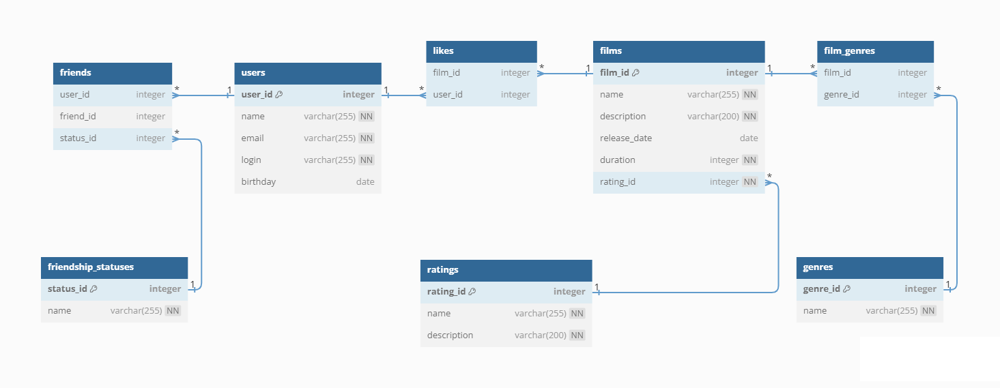

# java-filmorate
Template repository for Filmorate project.

**Database ER-diagram**


### Примеры запросов и результатов для основных операций приложения java-filmorate.

**1. Создать пользователя**
```
INSERT INTO users
VALUES (DEFAULT, 'Maria', 'maria@mail.ru', 'loginMaria', '2000-01-01');
```
Результат:
```
SELECT * FROM users
WHERE user_id = 1;
```
| user_id | name  | email         | login      | birthday                 |
|---------|-------|---------------|------------|--------------------------|
| 1       | Maria | maria@mail.ru | loginMaria | 2000-01-01T00:00:00.000Z |
---

**2. Обновить пользователя с id = 1**
```
UPDATE users SET "name" = 'Maria Super', "login" = 'loginMariaSuper'
WHERE user_id = 1;
```
Результат:
```
SELECT * FROM users
WHERE user_id = 1;
```
| user_id | name        | email         | login           | birthday                 |
|---------|-------------|---------------|-----------------|--------------------------|
| 1       | Maria Super | maria@mail.ru | loginMariaSuper | 2000-01-01T00:00:00.000Z |
---

**3. Получить всех пользователей**
```
SELECT * FROM users;
```
Результат:

| user_id | name  | email         | login      | birthday                 |
|---------|-------|---------------|------------|--------------------------|
| 1       | Maria | maria@mail.ru | loginMaria | 2000-01-01T00:00:00.000Z |
| 2       | Ira   | ira@mail.ru   | loginIra   | 2010-10-10T00:00:00.000Z |
| 3       | Luba  | luba@mail.ru  | loginLuba  | 2002-02-02T00:00:00.000Z |
| 4       | Sori  | sori@mail.ru  | loginSori  | 2003-03-03T00:00:00.000Z |
| 5       | Kuta  | kuta@mail.ru  | loginKuta  | 2004-04-04T00:00:00.000Z |
---

**4. Получить пользователя с id = 2**
```
SELECT * FROM users
WHERE user_id = 2;
```
Результат:

| user_id | name | email       | login    | birthday                 |
|---------|------|-------------|----------|--------------------------|
| 2       | Ira  | ira@mail.ru | loginIra | 2010-10-10T00:00:00.000Z |
---

**5. Получить список друзей пользователя с id = 1**
```
SELECT * FROM users
WHERE user_id IN (
    SELECT friend_id
    FROM friends
    WHERE user_id = 1 AND status_id = 1
    GROUP BY friend_id);
```
Общий вид таблицы friends:
```
SELECT * FROM friends;
```
| user_id | friend_id | status_id |
|---------|-----------|-----------|
| 1       | 2         | 2         |
| 1       | 3         | 1         |
| 3       | 1         | 1         |
| 1       | 4         | 1         |
| 4       | 1         | 1         |
| 2       | 4         | 1         |
| 4       | 2         | 1         |
| 5       | 3         | 1         |
| 3       | 5         | 1         |

Результат запроса:

| user_id | name | email        | login     | birthday                 |
|---------|------|--------------|-----------|--------------------------|
| 3       | Luba | luba@mail.ru | loginLuba | 2002-02-02T00:00:00.000Z |
| 4       | Sori | sori@mail.ru | loginSori | 2003-03-03T00:00:00.000Z |
---

**6. Получить список общих друзей пользователей с id = 1 и id = 2**
```
SELECT *
FROM users
WHERE user_id IN (
    SELECT friend_id
    FROM friends
    WHERE (user_id = 1 AND status_id = 1) OR (user_id = 2 AND status_id = 1)
    GROUP BY friend_id
    HAVING COUNT(friend_id) > 1);
```
Общий вид таблицы friends:
```
SELECT * FROM friends;
```
| user_id | friend_id | status_id |
|---------|-----------|-----------|
| 1       | 2         | 2         |
| 1       | 3         | 1         |
| 3       | 1         | 1         |
| 1       | 4         | 1         |
| 4       | 1         | 1         |
| 2       | 4         | 1         |
| 4       | 2         | 1         |
| 5       | 3         | 1         |
| 3       | 5         | 1         |

Результат запроса:

| user_id | name | email        | login     | birthday                 |
|---------|------|--------------|-----------|--------------------------|
| 4       | Sori | sori@mail.ru | loginSori | 2003-03-03T00:00:00.000Z |
---

**7. Отправление запроса пользователем с id = 5 на добавление пользователя с id = 1 в друзья**
```
INSERT INTO friends("user_id", "friend_id", "status_id")
VALUES (1, 5, 2);

INSERT INTO friends("user_id", "friend_id", "status_id")
VALUES (5, 1, 2);
```
Результат:
```
SELECT * FROM friends;
```
| user_id | friend_id | status_id |
|---------|-----------|-----------|
| 1       | 2         | 2         |
| 1       | 3         | 1         |
| 3       | 1         | 1         |
| 1       | 4         | 1         |
| 4       | 1         | 1         |
| 2       | 4         | 1         |
| 4       | 2         | 1         |
| 5       | 3         | 1         |
| 3       | 5         | 1         |
| 1       | 5         | 2         |
| 5       | 1         | 2         |
---

**8. Добавить пользователей с id = 5 и id = 1 друг другу в друзья после принятия запроса на дружбу**
```
UPDATE friends SET "status_id" = 1
WHERE user_id = 1 AND friend_id = 5;

UPDATE friends SET "status_id" = 1
WHERE user_id = 5 AND friend_id = 1;
```
Результат до запроса:
```
SELECT * FROM friends;
```
| user_id | friend_id | status_id |
|---------|-----------|-----------|
| 1       | 2         | 2         |
| 1       | 3         | 1         |
| 3       | 1         | 1         |
| 1       | 4         | 1         |
| 4       | 1         | 1         |
| 2       | 4         | 1         |
| 4       | 2         | 1         |
| 5       | 3         | 1         |
| 3       | 5         | 1         |
| 1       | 5         | 2         |
| 5       | 1         | 2         |

Результат после запроса:
```
SELECT * FROM friends;
```
| user_id | friend_id | status_id |
|---------|-----------|-----------|
| 1       | 2         | 2         |
| 1       | 3         | 1         |
| 3       | 1         | 1         |
| 1       | 4         | 1         |
| 4       | 1         | 1         |
| 2       | 4         | 1         |
| 4       | 2         | 1         |
| 5       | 3         | 1         |
| 3       | 5         | 1         |
| 1       | 5         | 1         |
| 5       | 1         | 1         |
---

**9. Удалить пользователя с id = 1 и информацию о нем**
```
DELETE FROM friends
WHERE user_id = 1 OR friend_id = 1;

DELETE FROM users WHERE user_id = 1;
```
Результат до запроса:
```
SELECT * FROM users;
```
| user_id | name  | email         | login      | birthday                 |
|---------|-------|---------------|------------|--------------------------|
| 1       | Maria | maria@mail.ru | loginMaria | 2000-01-01T00:00:00.000Z |
| 2       | Ira   | ira@mail.ru   | loginIra   | 2010-10-10T00:00:00.000Z |
| 3       | Luba  | luba@mail.ru  | loginLuba  | 2002-02-02T00:00:00.000Z |
| 4       | Sori  | sori@mail.ru  | loginSori  | 2003-03-03T00:00:00.000Z |
| 5       | Kuta  | kuta@mail.ru  | loginKuta  | 2004-04-04T00:00:00.000Z |
```
SELECT * FROM friends;
```
| user_id | friend_id | status_id |
|---------|-----------|-----------|
| 1       | 2         | 2         |
| 1       | 3         | 1         |
| 3       | 1         | 1         |
| 1       | 4         | 1         |
| 4       | 1         | 1         |
| 2       | 4         | 1         |
| 4       | 2         | 1         |
| 5       | 3         | 1         |
| 3       | 5         | 1         |

Результат после запроса:
```
SELECT * FROM users;
```
| user_id | name | email        | login     | birthday                 |
|---------|------|--------------|-----------|--------------------------|
| 2       | Ira  | ira@mail.ru  | loginIra  | 2010-10-10T00:00:00.000Z |
| 3       | Luba | luba@mail.ru | loginLuba | 2002-02-02T00:00:00.000Z |
| 4       | Sori | sori@mail.ru | loginSori | 2003-03-03T00:00:00.000Z |
| 5       | Kuta | kuta@mail.ru | loginKuta | 2004-04-04T00:00:00.000Z |
```
SELECT * FROM friends;
```
| user_id | friend_id | status_id |
|---------|-----------|-----------|
| 2       | 4         | 1         |
| 4       | 2         | 1         |
| 5       | 3         | 1         |
| 3       | 5         | 1         |
---

**10. Удалить из друзей друг у друга пользователя с id = 1 и пользователя с id = 3**
```
DELETE FROM friends
WHERE (user_id = 3 AND friend_id = 1) OR (user_id = 1 AND friend_id = 3);
```
Результат до запроса:
```
SELECT * FROM friends;
```
| user_id | friend_id | status_id |
|---------|-----------|-----------|
| 1       | 2         | 2         |
| 1       | 3         | 1         |
| 3       | 1         | 1         |
| 1       | 4         | 1         |
| 4       | 1         | 1         |
| 2       | 4         | 1         |
| 4       | 2         | 1         |
| 5       | 3         | 1         |
| 3       | 5         | 1         |

Результат после запроса:
```
SELECT * FROM friends;
```
| user_id | friend_id | status_id |
|---------|-----------|-----------|
| 1       | 2         | 2         |
| 1       | 4         | 1         |
| 4       | 1         | 1         |
| 2       | 4         | 1         |
| 4       | 2         | 1         |
| 5       | 3         | 1         |
| 3       | 5         | 1         |
---

**11. Создать фильм**
```
INSERT INTO films
VALUES (DEFAULT, 'Parrot', 'story about a parrot', '2013-12-12', 60, 2);
```
Результат:
```
SELECT * FROM films
WHERE film_id = 6;
```
| film_id | name   | description          | release_date             | duration | rating_id |
|---------|--------|----------------------|--------------------------|----------|-----------|
| 6       | Parrot | story about a parrot | 2013-12-12T00:00:00.000Z | 60       | 2         |
---

**12. Обновить фильм с id = 6**
```
UPDATE films SET "name" = 'Speaking parrot', "description" = 'the story of a talking parrot'
WHERE film_id = 6;
```
Результат запроса:
```
SELECT * FROM films
WHERE film_id = 6;
```
| film_id | name            | description                   | release_date             | duration | rating_id |
|---------|-----------------|-------------------------------|--------------------------|----------|-----------|
| 6       | Speaking parrot | the story of a talking parrot | 2013-12-12T00:00:00.000Z | 60       | 2         |
---

**13. Получить список всех фильмов**
```
SELECT 
    f.film_id,
    f.name,
    f.description,
    f.release_date,
    f.duration,
    r.name AS rating
FROM films AS f
LEFT JOIN ratings AS r ON f.rating_id=r.rating_id;
```
Результат:

| film_id | name            | description                   | release_date             | duration | rating |
|---------|-----------------|-------------------------------|--------------------------|----------|--------|
| 1       | Cat             | story about a cat             | 2000-01-01T00:00:00.000Z | 60       | G      |
| 2       | Dog             | story about a dog             | 2010-10-10T00:00:00.000Z | 60       | G      |
| 3       | Grasshopper     | story about a grasshopper     | 2002-02-02T00:00:00.000Z | 60       | G      |
| 4       | Blue tractor    | the story of the blue tractor | 2003-03-03T00:00:00.000Z | 100      | G      |
| 5       | Chip and Dale   | the story of Chip and Dale    | 2004-04-04T00:00:00.000Z | 120      | G      |
| 6       | Speaking parrot | the story of a talking parrot | 2013-12-12T00:00:00.000Z | 60       | PG     |

---

**14. Получить фильм с id = 1**
```
SELECT 
    f.film_id,
    f.name,
    f.description,
    f.release_date,
    f.duration,
    r.name AS rating
FROM films AS f
LEFT JOIN ratings AS r ON f.rating_id=r.rating_id
WHERE film_id = 1;
```
Результат:

| film_id | name | description       | release_date             | duration | rating |
|---------|------|-------------------|--------------------------|----------|--------|
| 1       | Cat  | story about a cat | 2000-01-01T00:00:00.000Z | 60       | G      |

---
**15. Получить 10 самых популярных фильмов**
```
SELECT 
    l.film_id,
    f.name,
    f.description,
    f.release_date,
    f.duration,
    r.name AS rating,
    COUNT(l.film_id) AS count_like
FROM likes AS l
JOIN films AS f ON f.film_id=l.film_id
JOIN ratings AS r ON r.rating_id=f.rating_id
GROUP BY l.film_id, f.name, f.description, f.release_date, f.duration, rating
ORDER BY COUNT(l.film_id) DESC
LIMIT 10;
```
Результат:

| film_id | name          | description                | release_date             | duration | rating | count_like |
|---------|---------------|----------------------------|--------------------------|----------|--------|------------|
| 5       | Chip and Dale | the story of Chip and Dale | 2004-04-04T00:00:00.000Z | 120      | G      | 3          |
| 1       | Cat           | story about a cat          | 2000-01-01T00:00:00.000Z | 60       | G      | 2          |
| 3       | Grasshopper   | story about a grasshopper  | 2002-02-02T00:00:00.000Z | 60       | G      | 1          |
---

**16. Добавить лайк фильму с id = 2 от пользователя с id = 1**
```
INSERT INTO likes("film_id", "user_id")
VALUES (2, 1);
```
Результат:
```
SELECT * FROM likes;
```
| film_id | user_id |
|---------|---------|
| 5       | 1       |
| 5       | 2       |
| 5       | 3       |
| 1       | 1       |
| 1       | 2       |
| 3       | 2       |
| 2       | 1       |
---

**17. Удалить лайк фильму с id = 3 от пользователя с id = 2**
```
DELETE FROM likes WHERE film_id = 3 AND user_id = 2;
```
Результат:
```
SELECT * FROM likes;
```
| film_id | user_id |
|---------|---------|
| 5       | 1       |
| 5       | 2       |
| 5       | 3       |
| 1       | 1       |
| 1       | 2       |
| 2       | 1       |
---

**18. Удалить фильм с id = 1 и информацию о нем**
```
DELETE FROM film_genres WHERE film_id = 1;
DELETE FROM likes WHERE film_id = 1;
DELETE FROM films WHERE film_id = 1;
```
Результат до запроса:
```
SELECT * FROM films;
```
| film_id | name          | description                   | release_date             | duration | rating_id |
|---------|---------------|-------------------------------|--------------------------|----------|-----------|
| 1       | Cat           | story about a cat             | 2000-01-01T00:00:00.000Z | 60       | 1         |
| 2       | Dog           | story about a dog             | 2010-10-10T00:00:00.000Z | 60       | 1         |
| 3       | Grasshopper   | story about a grasshopper     | 2002-02-02T00:00:00.000Z | 60       | 1         |
| 4       | Blue tractor  | the story of the blue tractor | 2003-03-03T00:00:00.000Z | 100      | 1         |
| 5       | Chip and Dale | the story of Chip and Dale    | 2004-04-04T00:00:00.000Z | 120      | 1         |
```
SELECT * FROM film_genres;
```
| film_id | genre_id |
|---------|----------|
| 1       | 1        |
| 2       | 1        |
| 3       | 1        |
| 4       | 1        |
| 5       | 1        |
```
SELECT * FROM likes;
```
| film_id | user_id |
|---------|---------|
| 5       | 1       |
| 5       | 2       |
| 5       | 3       |
| 1       | 1       |
| 1       | 2       |
| 3       | 2       |

Результат после запроса:
```
SELECT * FROM films;
```
| film_id | name          | description                   | release_date             | duration | rating_id |
|---------|---------------|-------------------------------|--------------------------|----------|-----------|
| 2       | Dog           | story about a dog             | 2010-10-10T00:00:00.000Z | 60       | 1         |
| 3       | Grasshopper   | story about a grasshopper     | 2002-02-02T00:00:00.000Z | 60       | 1         |
| 4       | Blue tractor  | the story of the blue tractor | 2003-03-03T00:00:00.000Z | 100      | 1         |
| 5       | Chip and Dale | the story of Chip and Dale    | 2004-04-04T00:00:00.000Z | 120      | 1         |
```
SELECT * FROM film_genres;
```
| film_id | genre_id |
|---------|----------|
| 2       | 1        |
| 3       | 1        |
| 4       | 1        |
| 5       | 1        |
```
SELECT * FROM likes;
```
| film_id | user_id |
|---------|---------|
| 5       | 1       |
| 5       | 2       |
| 5       | 3       |
| 3       | 2       |
---